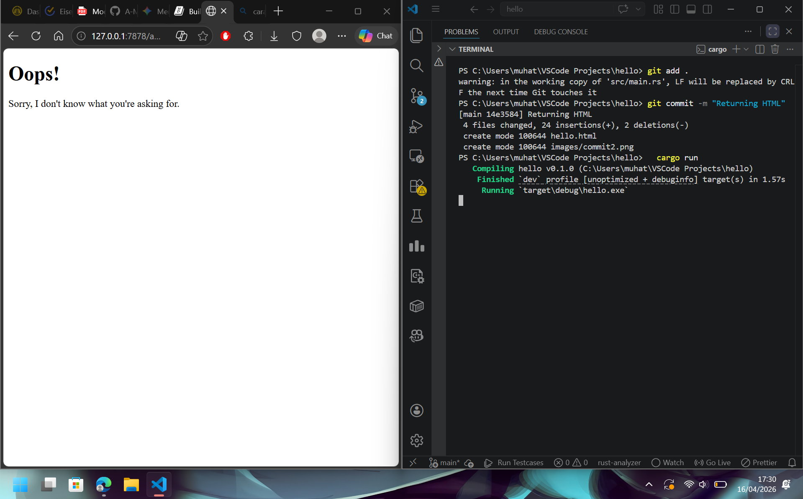

**Milestone 1 Reflection Notes** 
Membangun web server secara manual di Rust memberikan gambaran praktis tentang cara kerjanya di tingkat dasar. Di level jaringan, kita menggunakan TcpListener untuk membuka port dan menerima koneksi TCP yang masuk, di mana kita harus menangani upaya koneksi dan perilaku browser secara langsung. Setelah terhubung, proses ekstraksi data menggunakan BufReader memperlihatkan bahwa protokol HTTP sebenarnya hanyalah aliran teks biasa (plain text). Secara keseluruhan, ini menyadarkan kita bahwa web server pada intinya adalah gabungan dari manajemen koneksi jaringan dan proses membaca teks baris demi baris. 

**Milestone 2 Reflection Notes** 

Menambahkan implementasi fungsi sehingga port menampilkan html. 

**Milestone 3 Reflection Notes** 

Menambahkan implementasi error handling ketika resource tidak ditemukan. 

**Milestone 4 Reflection Notes** 
Penggunaan thread-sleep biasanya untuk handle deadlock atau kondisi lainnya, di commit ini hanya digunakan sebagai testing saja (sleep 10 detik). 

**Milestone 5 Reflection Notes**
Penggunaan Thread Pool membuat server lebih stabil dengan membatasi jumlah thread pekerja, sehingga memori tidak jebol akibat pembuatan pekerja baru setiap kali ada request masuk. Sebagai gantinya, kita cukup menyiapkan beberapa pekerja tetap di awal yang bersiaga memantau satu antrean tugas (channel), sehingga saat ada request baru, tugas tersebut tinggal dilempar ke antrean untuk langsung dieksekusi secara bergantian oleh pekerja mana pun yang sedang menganggur.
