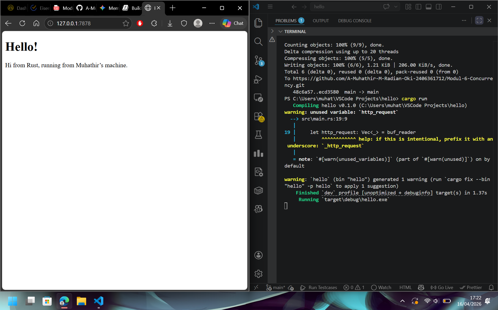

**Milestone 1 Reflection Notes**
Membangun web server secara manual di Rust memberikan gambaran praktis tentang cara kerjanya di tingkat dasar. Di level jaringan, kita menggunakan TcpListener untuk membuka port dan menerima koneksi TCP yang masuk, di mana kita harus menangani upaya koneksi dan perilaku browser secara langsung. Setelah terhubung, proses ekstraksi data menggunakan BufReader memperlihatkan bahwa protokol HTTP sebenarnya hanyalah aliran teks biasa (plain text). Secara keseluruhan, ini menyadarkan kita bahwa web server pada intinya adalah gabungan dari manajemen koneksi jaringan dan proses membaca teks baris demi baris.

**Milestone 2 Reflection Notes**

Menambahkan implementasi fungsi sehingga port menampilkan html.